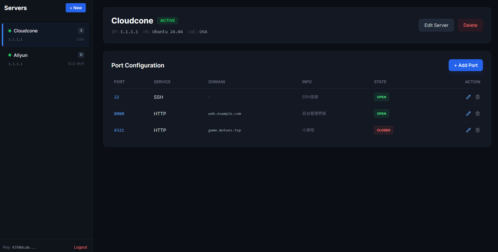

# PortManage



A port management tool to help you track your server's port status..

## Deployment

1. Clone the repo
    ```bash
    git clone https://github.com/Motues/PortManage.git
    ```
2. Install dependencies
    ```
    cd PortManage
    pnpm install
    ```
3. Start the server
    ```
    pnpm build
    pnpm start
    ```
    then open http://localhost:13000


